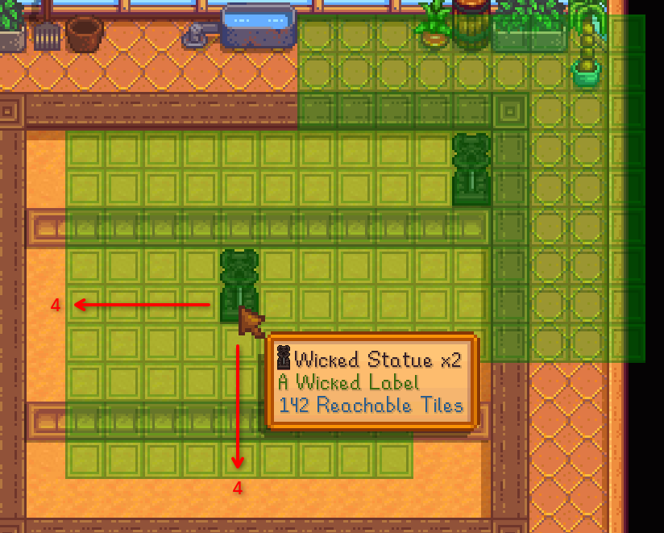
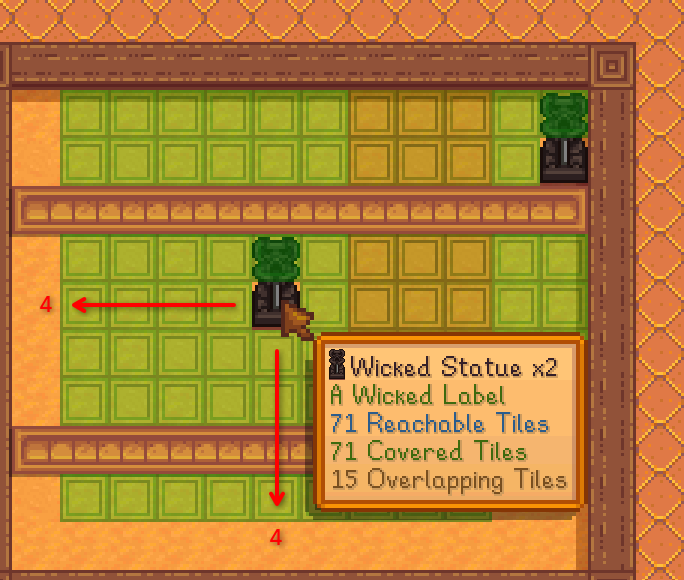
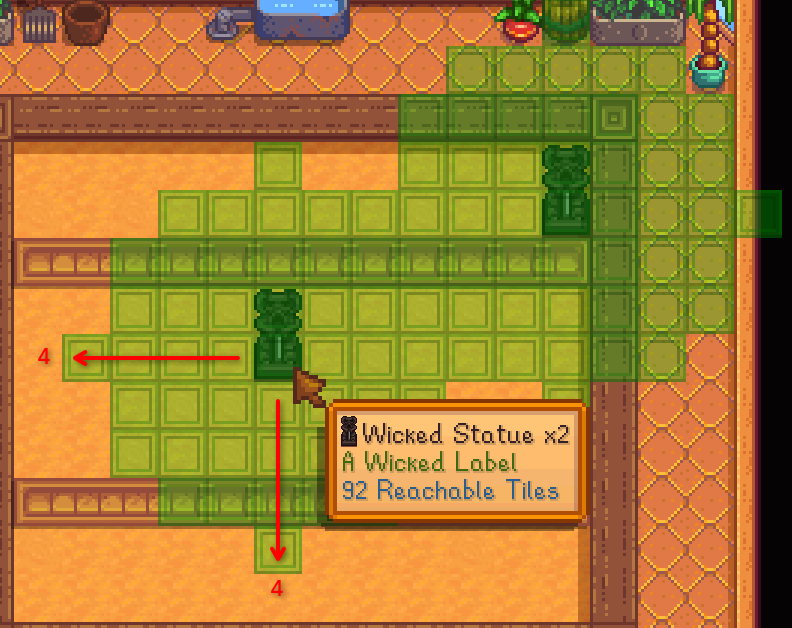
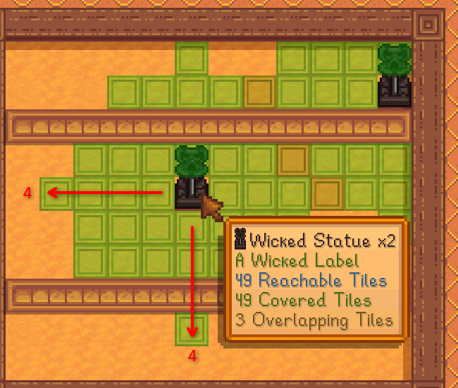
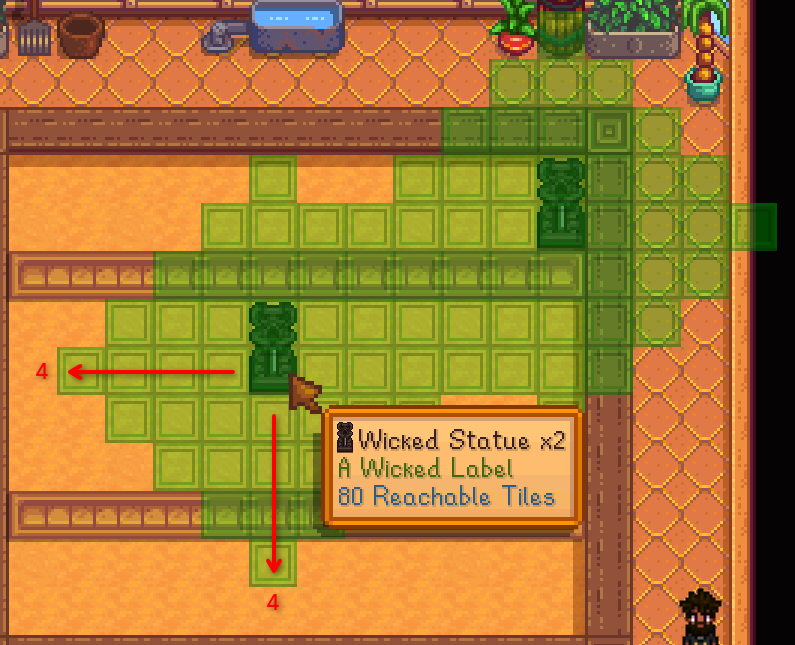
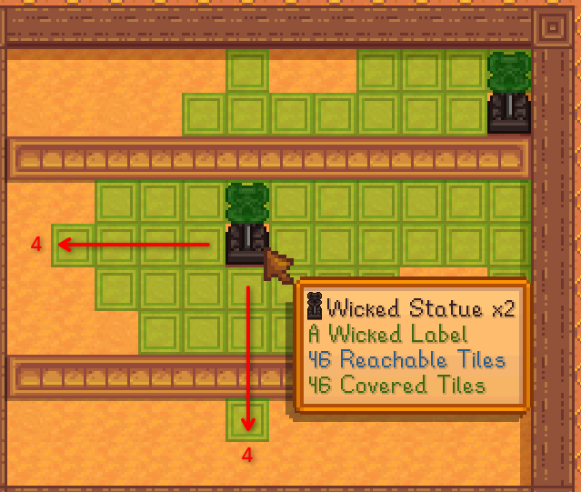

# Custom Item Effect Ranges

Give your placed objects an effect range overlay in UI Info Suite 2 Alternative, the same one
scarecrows, sprinklers and bee houses use.

This requires UI Info Suite 2 Alternative **v2.9.1 or newer**.

## Usage

Add your object's qualified item ID to the `ItemEffectRanges` data asset:

```json
{
  "Action": "EditData",
  "Target": "Mods/DazUki.UIInfoSuite2Alt/ItemEffectRanges",
  "Entries": {
    "(BC)YourModId.MyObject": {
      "Radius": 4,
      "Shape": "Square",
      "EffectLabel": "{{i18n:my-object-range-label}}",
      "AffectsCrops": true
    }
  }
}
```

The range shows while holding the item and when hovering a placed one with the range keybind
held (default `LeftControl`, or `LeftControl + LeftAlt` for every matching object nearby).

| Field | Type | Required | Default | Description |
|---|---|:---:|---|---|
| `Radius` | int | Yes | - | Effect radius in tiles, 1-50. |
| `Shape` | string | No | Square | *Square*, *Circle* or *Diamond* (case-insensitive). |
| `EffectLabel` | string | No | - | Line under the item name in the tooltip. |
| `AffectsCrops` | bool | No | false | Only highlight tiles a crop can sit on. |

## Shape and AffectsCrops

All six examples below are shown with `"Radius": 4` and two objects placed, so the overlap is visible.

|  | `"AffectsCrops": false` | `"AffectsCrops": true` |
|:---:|:---:|:---:|
| **Square** |  |  |
| **Circle** |  |  |
| **Diamond** |  |  |

**Shape** is only a *drawing*. UIIS2Alt has no way to know which tiles your object really
affects. Pick the shape that covers the same tiles your effect does, otherwise players see
an overlay that promises tiles your object never reaches.

**AffectsCrops** limits the overlay to tiles that can hold a crop, and turns tiles covered by
two or more of your objects orange so players can avoid wasting coverage. Turn it on when your
effect only does something on plantable/tillable ground.

The green line in the tooltip is your `EffectLabel`. Keep it a short phrase naming what the
area actually does - for example, the built-in wild tree overlay uses the label `Seed Range`,
so yours might be `Growth Range` or similar that fits for your object.

## Notes

- No dependency needed. If UIIS2Alt isn't installed the patch never applies - no errors, no console noise.
- Use the **qualified** item ID with its type prefix - `(BC)` for big craftables, `(O)` for objects.
- If your ID matches something UIIS2Alt already handles, its built-in behavior is used instead.
- Invalid entries are skipped with a warning in the SMAPI console - check there if your range doesn't show up.
- CP's hot reload works here as well so you can tweak the fields without restarting the game.
